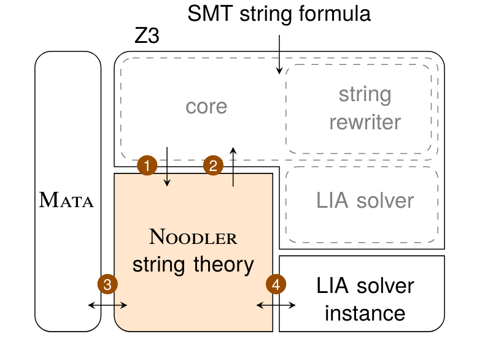

# What is Z3-Noodler

- Fork of the Z3 theorem prover
- String theory solver replaced by *Noodler*
  - *Stabilization-based procedure*
  - Heavy usage of *non deterministic automata*

---

# Handling automata and regular expressions

- Hard task
- Mata library
  - Union, concatenation, intersection, etc
- Very efficient and optimized

---

# Architecture

- Takes advantage of Z3's whole DPLL($\mathcal{T}$) architecture
- Parser, rewriter and LIA solver

---

# Architecture
  

# String Theory Core

- Axiom Saturation
- Decision Procedures
- Preprocessing
- Supoorted String Predicates and Limitations

# Axiom Saturation

- Goal: optimize the use of Z3's internal LIA solver
- Happens during preprocessing (before SAT solver first assignment)
- $len(t_1) >= 0, len(t_1.t_2) = len(t_1) + len(t_2)$
- $t_1 = t_2 \implies len(t_1) = len(t_2)$

# Axiom saturation

- Goal: deal with string functions/predicates
- Saturates the original formula with an equivalent one composed of:
  - Word (dis)equations
  - Regular constraints
- $\neg contains(s, "abc")$ becomes $s \notin \Sigma^*abc\Sigma^*$

# Decision Procedures: Stabilization Based

- Solves word (dis)equations with regular and length constraints
- For every variable, creates a NFA enconding regular contraints of the variable
- Iteratively refines the NFA according to word equations until stability is achieved
- Stability: for every word equation $s_1 = s_2$, the language of the NFA of $s_1$ equals the language of the NFA
of $s_2$
- After stability, length constraints are added and fed to the LIA solver

# Decision Procedures: Stabilization Method

- $zyx = xxz \land x \in a^* \land y \in a^+b^+ \land z \in b^*$
- Regular constraints enforce *UNSAT*

# Decision Procedures: Nielsen Transformation

- Efficient for quadratic equations
- Creates a graph encoding the system and reason about it
- Complex

# Preprocessing

- Each DP aforementioned employs different preprocessing steps
- Simple unsatisfiable patterns are checked for early termination
- $xy = zw \land len(x) = len(z) \implies y = w$

# Supported String Predicates and Limitations

- $replace, substr, at, indexof, prefix, suffix, contains$
- Limited support for $\neg contains$
- Don't support $replace\_all$ and $to/from\_int$
- Z3-Noodler is complete for the chain-free fragment with unbounded disequations, regular constraints and quadratic equations
- Outside of this, the theory is sound but not complete

# Experiments

- Three sets of benchmarks: *Regex*, *Equations* and *Predicates Small*
- Z3-Noodler is good in the *Regex* group in number of solved instances as well in average runtime
- The same happens in the *Equations* group
- cvc5 is the best one in *Predicates Small*, while Z3-Noodler performed poorly
- Z3-Noodler could, however, be further improved by proper axiom saturation for predicates or lazy predicate evaluation

# The end

- Thanks!
